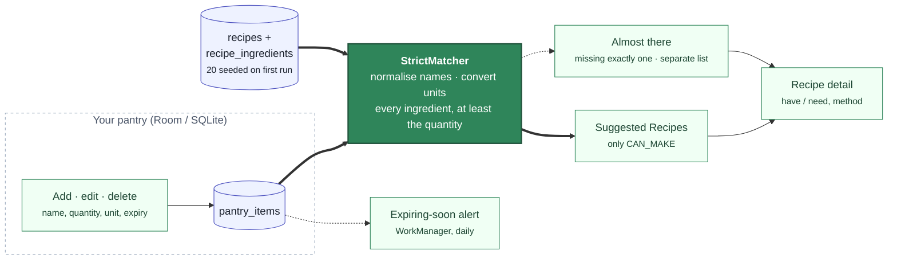

<h1 align="center">Smart Pantry Manager</h1>

<p align="center">
  <strong>Cook what you already have. Waste less of it.</strong><br>
  A Java Android app that tracks the ingredients in your pantry and suggests recipes you can cook
  <b>right now</b>, strictly from what is there: no shopping trip, no "almost" recipes in the main list.
  Built for <b>Mobile App Development 700</b> as an individual practice work.
</p>

<p align="center">
  <a href="https://github.com/Billykat7/spm/actions/workflows/ci.yml"></a>
  
  
  
  
  
  
</p>

<p align="center">
  <a href="#getting-started"><strong>Getting started</strong></a> ·
  <a href="#the-strict-matching-rule">The strict-matching rule</a> ·
  <a href="#database-room-over-sqlite-and-why">Database choice</a> ·
  <a href="https://github.com/Billykat7/spm/milestones">Milestones</a> &amp; <a href="https://github.com/Billykat7/spm/issues">issues</a> ·
  <a href="docs/guideline.md">Non-negotiables</a> ·
  <a href="docs/REPORT/README.md">Report</a> ·
  <a href="docs/DEMO/README.md">Video</a>
</p>

---

## The problem

Half a bag of spinach, three eggs, the end of a block of cheese: the food that goes in the bin is
rarely a whole shop, it is the leftovers nobody remembered. Recipe apps make it worse by suggesting
dishes that need one more trip to the store. The Smart Pantry Manager does the opposite. It keeps a
list of what is actually in your pantry, with quantities and expiry dates, and shows you only the
recipes you can make from that list today.

## What the app does

You add ingredients as you buy or find them (name, quantity, unit, an optional expiry date). The app
seeds twenty recipes on first run. The **Suggested Recipes** tab runs the strict-matching rule
against your pantry every time it changes: a recipe appears the moment the last missing ingredient
goes in, and disappears the moment it comes out. Tap a recipe for its full ingredient list and method.
A settings screen controls expiring-soon alerts and whether expired items still count.



<p align="center"><em>Every screen is a view onto the pantry table. The matcher is the only code that decides what you can cook.</em></p>

## The strict-matching rule

A recipe is **suggested only when every ingredient it requires is in the pantry, in at least the
required quantity**. Four of five ingredients is not a match. The rule lives in one pure-Java method,
`StrictMatcher.match()`, and is tested against every case a marker could try: plurals (`tomatoes`
satisfies `tomato`), case and spacing, aliases (`cilantro` is `coriander`), units (`1 kg` covers
`250 g`, `1 l` covers `2 cups`), quantities short by a gram, duplicate rows summed, expired items
ignored. Recipes missing exactly one ingredient can be shown as **Almost there**, under their own
heading, never in the suggested list. The rule and its guards are written down in
[`docs/guideline.md`](docs/guideline.md).

## Features

### For the cook

| | Feature |
|---|---|
| 🧺 | **A pantry you can trust:** add, edit and delete ingredients with quantity, unit and expiry; validation stops a blank name or a zero quantity before it is saved |
| 🍳 | **Recipes you can make right now:** the suggested list updates itself as the pantry changes, no refresh |
| 🔍 | **Honest when there is nothing:** "No recipes match your pantry yet, add more ingredients", with a button to the pantry |
| 📖 | **Recipe detail:** every ingredient marked have or need with the quantities, then the method |
| ⏰ | **Expiring-soon alerts:** a daily check and a notification naming what to use first, with a threshold you set |
| 🌗 | **Light and dark**, large-font safe, every icon described for a screen reader |

### For the marker

| Requirement (brief) | Where it is |
|---|---|
| Java only, Android Studio (§3.1) | Every file under `app/` is Java; CI fails on a `.kt` file |
| Five screens, Fragments in one host and Activities by Intent (§3.1) | Pantry, Recipes and Settings tabs in `MainActivity`; add/edit and recipe detail as Activities opened by explicit Intents with typed extras |
| `RecyclerView` with a custom adapter (§3.1) | `PantryAdapter`, `RecipeAdapter`, `RecipeIngredientAdapter` (`ListAdapter` + `DiffUtil`) |
| Navigation element (§3.1) | A Material bottom navigation bar |
| Input validation (§3.1) | `Validators`, field-level errors, nothing written until valid |
| Full CRUD that persists (§3.2) | `PantryRepository` over Room; a test closes and reopens the database |
| 15–20 seeded recipes (§2.2) | Twenty, from `assets/recipes.json`, seeded once |
| Zero-match feedback (§2.2) | A distinct empty state, never a blank screen |
| No maps, location, payments (§2.3, §3.3) | A guard script fails CI on the permission, the dependency or the import |
| ≥10 meaningful commits, README (§4) | One milestone a week, `Issue N:` commits, this file |

## Database: Room over SQLite, and why

The app persists with **Room over SQLite, on the device**. It is the option the module's
persistent-data chapter covers, it needs no account, server or network (the app's whole scope is the
user's own pantry), and Room gives compile-time checked SQL, an exported schema the report's ER
diagram is drawn from, `LiveData` queries that let the Suggested Recipes screen update itself, and an
in-memory database for tests. Firebase would add a cloud dependency, an API key and a sign-in story
to an app that has no need for any of them; PostgreSQL would add a REST backend to build and host,
which is a second project. The data model is three tables: `pantry_items`, `recipes` and
`recipe_ingredients`. The decision and its alternatives are recorded as
decision 1.

## Tech stack

| Layer | Choice |
|-------|--------|
| Language | **Java 17**, no Kotlin anywhere under `app/`; Gradle scripts in Groovy |
| Platform | Android, `minSdk 26`, `targetSdk 35`, Android Studio, AndroidX |
| UI | **Material 3** (`Theme.Material3.DayNight`), ViewBinding, `RecyclerView` + `ListAdapter`, bottom navigation |
| State | `ViewModel` + `LiveData` |
| Database | **Room 2.6** over SQLite, exported schema, idempotent JSON seed |
| Background | **WorkManager** for the daily expiry check; a notification channel |
| Engine | Pure Java under `domain/matching/`: `IngredientNormaliser`, `UnitConverter`, `StrictMatcher` |
| Tests | JUnit 4 on the JVM (engine, validators, ViewModels); Room in-memory and Espresso under `androidTest` |
| CI | GitHub Actions on every pull request (guards, lint, unit tests, debug build); a `v*` tag builds the APK and attaches it to the release |

```text
app/src/main/java/com/btk/spm/
├── ui/              MainActivity, Tab; pantry/, recipes/, settings/ (Fragments, Activities, adapters, ViewModels)
├── data/            db/ (AppDatabase, DAOs), model/ (entities), repo/ (repositories), seed/ (recipes.json loader)
├── domain/          Unit, UnitKind, Quantity, MatchStatus; matching/ (the engine); validation/ (Validators)
├── settings/        AppPreferences, PrefKey
├── notifications/   ExpiryCheckWorker, NotificationChannels
└── util/            IntentKeys, ExpiryStatus
```

## Project documentation

| Document | What's in it |
|----------|--------------|
| **[Non-negotiables](docs/guideline.md)** | The ten rules a marker tests or that keep the code honest, each enforced by a test or a guard |
| **[Milestones](https://github.com/Billykat7/spm/milestones) & [issues](https://github.com/Billykat7/spm/issues)** | 7 milestones, 38 issues, the dependency graph, conventions, release tags, the pipeline |
| **How to read an issue** | The spec format, where code goes, the seven recorded decisions, the glossary, every issue in one table |
| **Labels** · **PR template** · **Releases** | The label set, what a pull request must show, one tag per milestone |
| **[Report](docs/REPORT/README.md)** · **[Video](docs/DEMO/README.md)** | Where the screenshots, diagrams, challenges, script and checklists live |
| **The brief** (`.btk/MAD700D/`, local, not in git) | Every requirement the milestones trace back to, by section number |

## Delivery at a glance

Each bar has **one block per issue**, so every merged pull request that closes an issue adds a 🟩 to
its milestone; a follow-up that closes nothing adds none. `scripts/milestone_progress.py` draws the
bars from GitHub's own issue states, and the pull request that closes an issue runs it with
`--assume-closed <N>`, so the bars read as they will once it merges. Each milestone doc lists its
issues and its order of work.

| | Milestone | Issues | Week | Release | Progress |
|---|-----------|--------|------|---------|----------|
| 1 | [Foundation & Local CI](https://github.com/Billykat7/spm/milestone/1) | #1–#7 | 1 | `v0.1.0` (to cut) | 🟩🟩🟩🟩🟩🟩🟩 **100%** (7/7 issues) |
| 2 | [Local Database (Room)](https://github.com/Billykat7/spm/milestone/2) | #8–#12 | 2 | `v0.2.0` (to cut) | ⬜⬜⬜⬜⬜ **0%** (0/5 issues) |
| 3 | [Pantry Management](https://github.com/Billykat7/spm/milestone/3) | #13–#17 | 3 | `v0.3.0` (to cut) | ⬜⬜⬜⬜⬜ **0%** (0/5 issues) |
| 4 | [Strict-Matching Engine](https://github.com/Billykat7/spm/milestone/4) ⚠️ | #18–#22 | 4 | `v0.4.0` (to cut) | ⬜⬜⬜⬜⬜ **0%** (0/5 issues) |
| 5 | [Suggested Recipes & Detail](https://github.com/Billykat7/spm/milestone/5) | #23–#27 | 5 | `v0.5.0` (to cut) | ⬜⬜⬜⬜⬜ **0%** (0/5 issues) |
| 6 | [Settings, Alerts & UX](https://github.com/Billykat7/spm/milestone/6) | #28–#32 | 6 | `v0.6.0` (to cut) | ⬜⬜⬜⬜⬜ **0%** (0/5 issues) |
| 7 | [Evidence, Report & Submission](https://github.com/Billykat7/spm/milestone/7) | #33–#38 | 7–8 | `v0.7.0` → **`v1.0.0`** | ⬜⬜⬜⬜⬜⬜ **0%** (0/6 issues) |
| ⭐ | **All milestones:** every tracked issue closed | #1–#38 | | | 🟩🟩🟩🟩🟩🟩🟩⬜⬜⬜⬜⬜⬜⬜⬜⬜⬜⬜⬜⬜⬜⬜⬜⬜⬜⬜⬜⬜⬜⬜⬜⬜⬜⬜⬜⬜⬜⬜ **18%** (7/38 issues) |


## Getting started

**Prerequisites:** Android Studio (current stable) with the API 35 SDK, any JDK 17 or newer to start
the Gradle wrapper, and an emulator image (API 35; API 26 for the minimum-SDK check). No account, API
key or server is needed. Gradle itself runs on a JetBrains Runtime 25, whatever `JAVA_HOME` says:
`gradle/gradle-daemon-jvm.properties` asks for it, and the first build downloads one if the machine has
none. I pinned it because Oracle GraalVM cannot build the app (its `jlink` lacks a module the Android
system-image step asks for), and Android Studio picked GraalVM for a fresh clone on my machine.

```bash
git clone https://github.com/Billykat7/spm.git
cd spm
export ANDROID_HOME="$HOME/Library/Android/sdk"   # the SDK path; not needed once Android Studio has opened the project
./gradlew assembleDebug                           # app/build/outputs/apk/debug/app-debug.apk
```

The command-line build needs to know where the Android SDK is: `ANDROID_HOME`, or the
`local.properties` Android Studio writes the first time it opens the project. The path above is
Android Studio's default on macOS; Studio shows the real one under *Settings > Languages & Frameworks >
Android SDK*.

Or open the folder in Android Studio, let Gradle sync, and press **Run** with an emulator selected.
Today the app opens on its three tabs, Pantry, Recipes and Settings, in light or dark with the
system setting; each tab still shows a placeholder (Issues 1 to 3). The pantry list, the seeded
recipes and the matcher arrive with the milestones below. Once they have, add a few ingredients on
the Pantry tab and open the Recipes tab.

**Before every push**, the same gate CI runs:

```bash
./scripts/ci-local.sh                 # guards (no Kotlin, no maps/location), lint, unit tests, debug build
./scripts/ci-local.sh --with-device   # plus Room and Espresso tests on the attached emulator
```

The gate prints one line per stage and stops at the first failure; CI runs the same script on every
pull request and on `main`, and its `gate` check must pass before a pull request can merge.
[`CONTRIBUTING.md`](CONTRIBUTING.md) has the whole loop and what each guard forbids.

## Contributing

- Branch `Issue/<N>/<short-slug>`, commits `Issue <N>: <imperative summary>`, one issue per pull request, no assistant trailer.
- The PR description is `docs/GITHUB/PR/M<n>/PR_<N>_DESCRIPTION.md`, with real evidence and a screenshot for any UI change, ending `Closes #<N>`. It is kept local and git-ignored, never committed; its text is synced to GitHub as the PR body.
- Every PR that closes an issue turns one block of its milestone's bar green, as the bar will read once it merges: by hand until Issue 7, then `python scripts/milestone_progress.py --assume-closed <N>`.
- The history is marked: at least ten real, incremental commits spread over the weeks; merge, never squash.

The whole loop, the gate's stages and the guards: [`CONTRIBUTING.md`](CONTRIBUTING.md). The code
rules: [`docs/guideline.md`](docs/guideline.md).

## Status

The bars above are the status. What they cannot say:

**Where the project is.** Milestone 1 done (`v0.1.0` to cut). The brief has been broken into seven milestones and
38 issues, each with a specification, acceptance criteria and a prompt; the seven decisions the brief
leaves open (database, build language, navigation shape, SDK levels, units, expired items, recipe
editing) are recorded. Issue 1, merged in pull request
[#39](https://github.com/Billykat7/spm/pull/39), created the Android project: a Java 17 app with
Groovy build scripts (`com.btk.spm`, minSdk 26, target and compile SDK 35, ViewBinding on) and the
package skeleton in place, which builds from a clean clone and runs on API 26 and API 35 emulators.
Issue 2, merged in pull request [#41](https://github.com/Billykat7/spm/pull/41), gave it one
Material 3 theme in light and dark (a leaf-green and amber palette), one type scale, every visible
string in `strings.xml` with a typed string failing Lint, and its own launcher icon. Issue 4, merged
in pull request [#42](https://github.com/Billykat7/spm/pull/42), added the gate: `./scripts/ci-local.sh` runs
the scope guards (no Kotlin, no maps, location or billing), Lint, the unit tests and the debug build,
GitHub Actions runs the same script on every pull request, and its check is required to merge into
`main`. Issue 6, merged in pull request [#43](https://github.com/Billykat7/spm/pull/43), added the
vocabulary every layer shares: the `Unit` and `UnitKind` enums carrying decision 5's factors,
`Quantity`, `MatchStatus`, `IntentKeys`, `PrefKey` and the validation result types, with a
conventions test that fails the build on a typed unit, status, extra or preference key. Issue 3, merged
in pull request [#44](https://github.com/Billykat7/spm/pull/44), built the navigation shell:
`MainActivity` hosts a bottom navigation that swaps the Pantry, Recipes and Settings Fragments,
keeps the selected tab across rotation, returns Back to Pantry and opens on any tab through
`MainActivity.intentFor`, and debug builds log every lifecycle callback for the video. Issue 5,
merged in pull request [#45](https://github.com/Billykat7/spm/pull/45), made a version tag a
release: pushing `v*.*.*` runs the gate on the tagged commit, builds the release APK with the tag's
version and publishes it as `spm-<tag>.apk` on the Releases page. Issue 7, in pull request
[#46](https://github.com/Billykat7/spm/pull/46), closes the milestone with the repository tooling:
labels, milestones and issues synced from the plan by script, the bars above drawn from GitHub's
issue states, issue and pull request templates, and the `v0.1.0` release note.

**What is next.** Tagging `v0.1.0` once this milestone's last pull request merges, then M2, the
Room database, in week 2; the pantry screens follow, and in week 4 the matching engine, which is the
critical path.
**`v1.0.0`, the submitted build, follows M7.**

**Tags.** None cut yet; `v0.1.0` is cut when Issue 7 merges (M1, `v0.1.0` to cut). Pushing a tag builds the APK and
publishes it on the GitHub Release (Issue 5); the steps are in
[`CONTRIBUTING.md`](CONTRIBUTING.md#releases).

## Licence

MIT; see [LICENSE](LICENSE).
