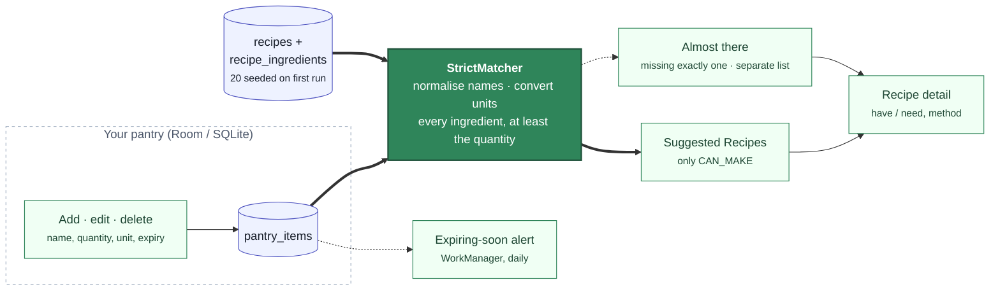
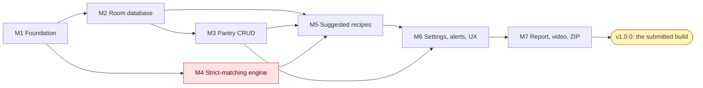

<h1 align="center">Smart Pantry Manager</h1>

<p align="center">
  <strong>Cook what you already have. Waste less of it.</strong><br>
  A Java Android app that tracks the ingredients in your pantry and suggests recipes you can cook
  <b>right now</b>, strictly from what is there: no shopping trip, no "almost" recipes in the main list.
  Built for <b>Mobile App Development 700</b> as an individual practice work.
</p>

<p align="center">
  
  
  
  
  
  
</p>

<p align="center">
  <a href="#getting-started"><strong>Getting started</strong></a> ·
  <a href="#the-strict-matching-rule">The strict-matching rule</a> ·
  <a href="#database-room-over-sqlite-and-why">Database choice</a> ·
  <a href="docs/GITHUB/README.md">Milestones &amp; issues</a> ·
  <a href="docs/guideline.md">Non-negotiables</a> ·
  <a href="docs/IDE/README.md">IDE rules &amp; prompts</a> ·
  <a href="docs/REPORT/README.md">Report</a> ·
  <a href="docs/DEMO/README.md">Video</a>
</p>

---

## The problem

Half a bag of spinach, three eggs, the end of a block of cheese: the food that goes in the bin is
rarely a whole shop, it is the leftovers nobody remembered. Recipe apps make it worse by suggesting
dishes that need one more trip to the store. The Smart Pantry Manager does the opposite. It keeps a
list of what is actually in your pantry, with quantities and expiry dates, and shows you only the
recipes you can make from that list today.

## What the app does

You add ingredients as you buy or find them (name, quantity, unit, an optional expiry date). The app
seeds twenty recipes on first run. The **Suggested Recipes** tab runs the strict-matching rule
against your pantry every time it changes: a recipe appears the moment the last missing ingredient
goes in, and disappears the moment it comes out. Tap a recipe for its full ingredient list and method.
A settings screen controls expiring-soon alerts and whether expired items still count.



<p align="center"><em>Every screen is a view onto the pantry table. The matcher is the only code that decides what you can cook.</em></p>

## The strict-matching rule

A recipe is **suggested only when every ingredient it requires is in the pantry, in at least the
required quantity**. Four of five ingredients is not a match. The rule lives in one pure-Java method,
`StrictMatcher.match()`, and is tested against every case a marker could try: plurals (`tomatoes`
satisfies `tomato`), case and spacing, aliases (`cilantro` is `coriander`), units (`1 kg` covers
`250 g`, `1 l` covers `2 cups`), quantities short by a gram, duplicate rows summed, expired items
ignored. Recipes missing exactly one ingredient can be shown as **Almost there**, under their own
heading, never in the suggested list. The rule and its guards are written down in
[`docs/guideline.md`](docs/guideline.md).

## Features

### For the cook

| | Feature |
|---|---|
| 🧺 | **A pantry you can trust:** add, edit and delete ingredients with quantity, unit and expiry; validation stops a blank name or a zero quantity before it is saved |
| 🍳 | **Recipes you can make right now:** the suggested list updates itself as the pantry changes, no refresh |
| 🔍 | **Honest when there is nothing:** "No recipes match your pantry yet, add more ingredients", with a button to the pantry |
| 📖 | **Recipe detail:** every ingredient marked have or need with the quantities, then the method |
| ⏰ | **Expiring-soon alerts:** a daily check and a notification naming what to use first, with a threshold you set |
| 🌗 | **Light and dark**, large-font safe, every icon described for a screen reader |

### For the marker

| Requirement (brief) | Where it is |
|---|---|
| Java only, Android Studio (§3.1) | Every file under `app/` is Java; CI fails on a `.kt` file |
| Five screens, Fragments in one host and Activities by Intent (§3.1) | Pantry, Recipes and Settings tabs in `MainActivity`; add/edit and recipe detail as Activities opened by explicit Intents with typed extras |
| `RecyclerView` with a custom adapter (§3.1) | `PantryAdapter`, `RecipeAdapter`, `RecipeIngredientAdapter` (`ListAdapter` + `DiffUtil`) |
| Navigation element (§3.1) | A Material bottom navigation bar |
| Input validation (§3.1) | `Validators`, field-level errors, nothing written until valid |
| Full CRUD that persists (§3.2) | `PantryRepository` over Room; a test closes and reopens the database |
| 15–20 seeded recipes (§2.2) | Twenty, from `assets/recipes.json`, seeded once |
| Zero-match feedback (§2.2) | A distinct empty state, never a blank screen |
| No maps, location, payments (§2.3, §3.3) | A guard script fails CI on the permission, the dependency or the import |
| ≥10 meaningful commits, README (§4) | One milestone a week, `Issue N:` commits, this file |

## Database: Room over SQLite, and why

The app persists with **Room over SQLite, on the device**. It is the option the module's
persistent-data chapter covers, it needs no account, server or network (the app's whole scope is the
user's own pantry), and Room gives compile-time checked SQL, an exported schema the report's ER
diagram is drawn from, `LiveData` queries that let the Suggested Recipes screen update itself, and an
in-memory database for tests. Firebase would add a cloud dependency, an API key and a sign-in story
to an app that has no need for any of them; PostgreSQL would add a REST backend to build and host,
which is a second project. The data model is three tables: `pantry_items`, `recipes` and
`recipe_ingredients`. The decision and its alternatives are recorded as
[decision 1](docs/GITHUB/ISSUES/README.md#open-decisions).

## Tech stack

| Layer | Choice |
|-------|--------|
| Language | **Java 17**, no Kotlin anywhere under `app/`; Gradle scripts in Groovy |
| Platform | Android, `minSdk 26`, `targetSdk 35`, Android Studio, AndroidX |
| UI | **Material 3** (`Theme.Material3.DayNight`), ViewBinding, `RecyclerView` + `ListAdapter`, bottom navigation |
| State | `ViewModel` + `LiveData` |
| Database | **Room 2.6** over SQLite, exported schema, idempotent JSON seed |
| Background | **WorkManager** for the daily expiry check; a notification channel |
| Engine | Pure Java under `domain/matching/`: `IngredientNormaliser`, `UnitConverter`, `StrictMatcher` |
| Tests | JUnit 4 on the JVM (engine, validators, ViewModels); Room in-memory and Espresso under `androidTest` |
| CI | GitHub Actions on every pull request (guards, lint, unit tests, debug build); a `v*` tag builds the APK and attaches it to the release |

```text
app/src/main/java/com/btk/spm/
├── ui/              MainActivity, Tab; pantry/, recipes/, settings/ (Fragments, Activities, adapters, ViewModels)
├── data/            db/ (AppDatabase, DAOs), model/ (entities), repo/ (repositories), seed/ (recipes.json loader)
├── domain/          Unit, UnitKind, Quantity, MatchStatus; matching/ (the engine); validation/ (Validators)
├── settings/        AppPreferences, PrefKey
├── notifications/   ExpiryCheckWorker, NotificationChannels
└── util/            IntentKeys, ExpiryStatus
```

## Project documentation

| Document | What's in it |
|----------|--------------|
| **[Non-negotiables](docs/guideline.md)** | The nine rules a marker tests or that keep the code honest, each enforced by a test or a guard |
| **[Milestones & issues](docs/GITHUB/README.md)** | 7 milestones, 38 issues, the dependency graph, conventions, release tags, the pipeline |
| **[How to read an issue](docs/GITHUB/ISSUES/README.md)** | The spec format, where code goes, the seven recorded decisions, the glossary, every issue in one table |
| **[IDE rules and prompts](docs/IDE/README.md)** | The rules every person and assistant follows; one prompt per issue |
| **[Labels](docs/GITHUB/LABELS/labels.yml)** · **[PR template](docs/GITHUB/PR/PR_TEMPLATE.md)** · **[Releases](docs/GITHUB/RELEASES/README.md)** | The label set, what a pull request must show, one tag per milestone |
| **[Report](docs/REPORT/README.md)** · **[Video](docs/DEMO/README.md)** | Where the screenshots, diagrams, challenges, script and checklists live |
| **The brief** (`.btk/MAD700D/`, local, not in git) | Every requirement the milestones trace back to, by section number |

## Delivery at a glance

Each bar has **one block per issue**, so every merged pull request adds a 🟩 to its milestone. The
bars are written by `scripts/milestone_progress.py` (Issue 7) from GitHub's own issue states, so they
cannot drift from the work; each milestone doc links its issues and draws its order of work.

| | Milestone | Issues | Week | Release | Progress |
|---|-----------|--------|------|---------|----------|
| 1 | [Foundation & Local CI](docs/GITHUB/MILESTONES/M1_foundation_local_ci.md) | #1–#7 | 1 | `v0.1.0` (to cut) | ⬜⬜⬜⬜⬜⬜⬜⬜⬜⬜ **0%** (0/7 issues) |
| 2 | [Local Database (Room)](docs/GITHUB/MILESTONES/M2_local_database_room.md) | #8–#12 | 2 | `v0.2.0` (to cut) | ⬜⬜⬜⬜⬜⬜⬜⬜⬜⬜ **0%** (0/5 issues) |
| 3 | [Pantry Management](docs/GITHUB/MILESTONES/M3_pantry_management.md) | #13–#17 | 3 | `v0.3.0` (to cut) | ⬜⬜⬜⬜⬜⬜⬜⬜⬜⬜ **0%** (0/5 issues) |
| 4 | [Strict-Matching Engine](docs/GITHUB/MILESTONES/M4_strict_matching_engine.md) ⚠️ | #18–#22 | 4 | `v0.4.0` (to cut) | ⬜⬜⬜⬜⬜⬜⬜⬜⬜⬜ **0%** (0/5 issues) |
| 5 | [Suggested Recipes & Detail](docs/GITHUB/MILESTONES/M5_suggested_recipes_detail.md) | #23–#27 | 5 | `v0.5.0` (to cut) | ⬜⬜⬜⬜⬜⬜⬜⬜⬜⬜ **0%** (0/5 issues) |
| 6 | [Settings, Alerts & UX](docs/GITHUB/MILESTONES/M6_settings_alerts_ux.md) | #28–#32 | 6 | `v0.6.0` (to cut) | ⬜⬜⬜⬜⬜⬜⬜⬜⬜⬜ **0%** (0/5 issues) |
| 7 | [Evidence, Report & Submission](docs/GITHUB/MILESTONES/M7_evidence_report_submission.md) | #33–#38 | 7–8 | `v0.7.0` → **`v1.0.0`** | ⬜⬜⬜⬜⬜⬜⬜⬜⬜⬜ **0%** (0/6 issues) |
| ⭐ | **All milestones:** every tracked issue closed | #1–#38 | | | ⬜⬜⬜⬜⬜⬜⬜⬜⬜⬜ **0%** (0/38 issues) |



## Getting started

**Prerequisites:** Android Studio (current stable) with the API 35 SDK, a JDK 17 or newer, and an
emulator image (API 35; API 26 for the minimum-SDK check). No account, API key or server is needed.

```bash
git clone https://github.com/Billykat7/spm.git
cd spm
./gradlew assembleDebug          # app/build/outputs/apk/debug/app-debug.apk
```

Or open the folder in Android Studio, let Gradle sync, and press **Run** with an emulator selected.
The app seeds its twenty recipes on first launch; add a few ingredients on the Pantry tab and open
the Recipes tab.

**Before every push**, the same gate CI runs:

```bash
./scripts/ci-local.sh                 # guards (no Kotlin, no maps/location), lint, unit tests, debug build
./scripts/ci-local.sh --with-device   # plus Room and Espresso tests on the attached emulator
```

> These commands exist from Milestone 1 (Issues 1 and 4). Until then the repository holds the plan,
> not the project; the *Delivery at a glance* bars say which.

## Contributing

- Branch `Issue/<N>/<short-slug>`, commits `Issue <N>: <imperative summary>`, one issue per pull request, no assistant trailer.
- The PR description is `docs/GITHUB/PR/M<n>/PR_<N>_DESCRIPTION.md`, with real evidence and a screenshot for any UI change, ending `Closes #<N>`.
- Every PR regenerates its milestone's bars: `python scripts/milestone_progress.py --assume-closed <N>`.
- The history is marked: at least ten real, incremental commits spread over the weeks; merge, never squash.

The whole workflow and the code rules: [`docs/GITHUB/README.md`](docs/GITHUB/README.md) and
[`docs/IDE/RULES`](docs/IDE/RULES).

## Status

The bars above are the status. What they cannot say:

**Where the project is.** Planned. The brief has been broken into seven milestones and 38 issues,
each with a specification, acceptance criteria and a prompt; the seven decisions the brief leaves
open (database, build language, navigation shape, SDK levels, units, expired items, recipe editing)
are [recorded](docs/GITHUB/ISSUES/README.md#open-decisions). No Android project exists yet: Issue 1
creates it.

**What is next.** M1 (the project, theme, navigation shell, CI, guards, enums) in week 1, then the
database, the pantry screens, and in week 4 the matching engine, which is the critical path.
**`v1.0.0`, the submitted build, follows M7.**

**Tags.** None cut. A tag builds the APK and attaches it to the GitHub Release (Issue 5); each
milestone's note lands in [`docs/GITHUB/RELEASES`](docs/GITHUB/RELEASES/) when its last issue closes.

## Licence

MIT; see [LICENSE](LICENSE).
