# Smart Pantry Manager

**An Android app that suggests only the recipes the pantry can make in full**

|                |                                                              |
|----------------|--------------------------------------------------------------|
| Student        | Billy Katalayi                                               |
| Student number | <StudentNumber>                                              |
| Module         | Mobile App Development 700                                   |
| Date           | 4 October 2026                                               |
| Repository     | [https://github.com/Billykat7/spm](https://github.com/Billykat7/spm) |

```{=openxml}
<w:p><w:r><w:br w:type="page"/></w:r></w:p>
```

# Table of contents

```{=openxml}
<w:sdt><w:sdtPr><w:docPartObj><w:docPartGallery w:val="Table of Contents"/><w:docPartUnique/></w:docPartObj></w:sdtPr><w:sdtContent><w:p><w:r><w:fldChar w:fldCharType="begin" w:dirty="true"/><w:instrText xml:space="preserve">TOC \o "1-2" \h \z \u</w:instrText><w:fldChar w:fldCharType="separate"/><w:t>Update this field (F9, or right-click and Update Field) to list the sections.</w:t><w:fldChar w:fldCharType="end"/></w:r></w:p></w:sdtContent></w:sdt>
<w:p><w:r><w:br w:type="page"/></w:r></w:p>
```

The exported document generates its table of contents here from the headings below.

# Introduction

Much of the food a household throws away was bought for one meal and then forgotten: half a bag of
spinach at the back of the fridge, three tomatoes softening behind the milk. The food was there all
along. What was missing was a quick answer to "what can I cook with what I already have?", asked
before the next shop rather than after the bin.

Smart Pantry Manager is an Android app for one person cooking at home who wants to use what is
already in the kitchen. The user records each ingredient with a quantity, a unit and, optionally, an
expiry date. The app keeps that pantry on the phone, marks items that are expired or about to expire,
sends a daily reminder about the ones expiring soon, and compares the pantry with twenty seeded
recipes to say which of them can be cooked right now.

That comparison follows one strict rule: a recipe is suggested only when every ingredient it needs is
in the pantry in at least the required quantity, so four out of five ingredients is not a match. The
rule is deliberately unforgiving. A suggestion the user cannot actually cook sends them back to the
shop, which is the opposite of what the app is for. Recipes that miss by exactly one ingredient are
shown separately, under their own heading, as a prompt rather than a promise.

The app is written in Java for Android API 26 to 35, with no location, maps or payment features.

# System design

## Screen flow

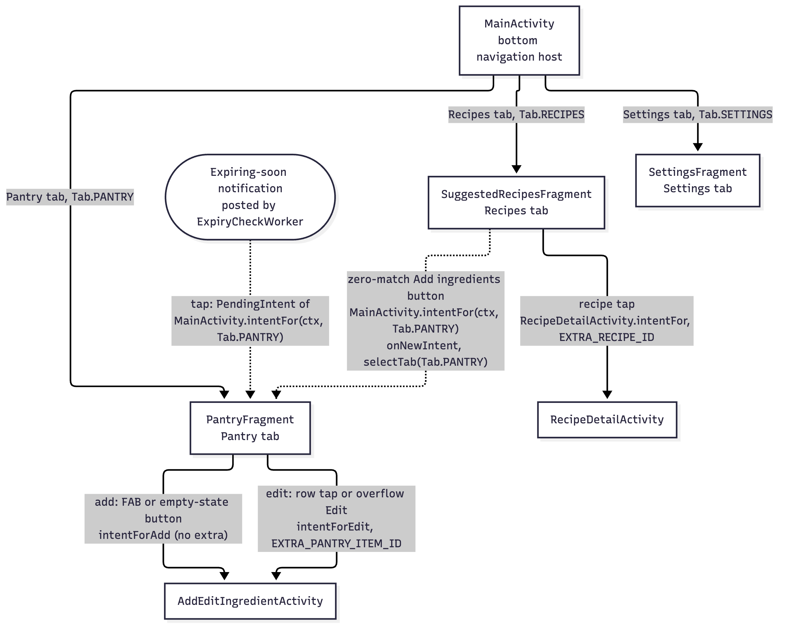{width=90%}

*Figure 1. Screen flow: one host Activity with three tab Fragments, two Activities opened by explicit
Intents, and the notification's way back in.*

The app has one host Activity, `MainActivity`, which holds the toolbar and a bottom navigation bar.
The bar swaps three Fragments in a single container: the Pantry tab (`PantryFragment`), the Recipes
tab (`SuggestedRecipesFragment`) and the Settings tab (`SettingsFragment`). Back from another tab
returns to the Pantry tab first.

The two screens that carry data are separate Activities, started by explicit Intents (Android
Developers, n.d.b). The Pantry tab's floating action button opens `AddEditIngredientActivity` with no
extra, which means "add"; a row's overflow menu opens the same Activity with the item's id, which
means "edit". Delete shows a confirmation dialog, then a Snackbar with Undo. On the Recipes tab, a tap on a suggested or an almost-there recipe opens
`RecipeDetailActivity` with the recipe's id, and the zero-match state offers a button that switches to
the Pantry tab. Turning on the expiry alert in Settings asks for the notification permission on
Android 13 and later. A daily background job posts the expiry notification, and tapping it opens `MainActivity` on the
Pantry tab.

This is decision 3: Fragments for the three peer screens that share the navigation bar, Activities
for the two screens opened about one record.

## Data model

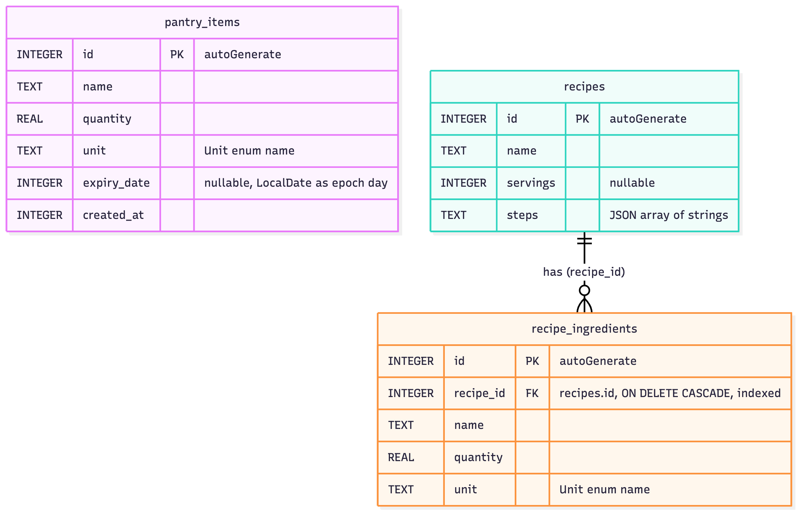{width=90%}

*Figure 2. The three tables of the Room database, version 1, as exported to
`app/schemas/com.btk.spm.data.db.AppDatabase/1.json`.*

The database has three tables. `pantry_items` is the user's own data and the record the create, read,
update and delete cycle works on: an id, a name, a quantity stored as a real number, a unit, an
optional expiry date stored as an epoch day, and the time the row was created, which keeps the list
order stable. `recipes` holds the twenty seeded recipes, each with a name, an optional number of
servings and its method steps. `recipe_ingredients` holds one row per line of a recipe, with its
name, quantity and unit, and a foreign key to `recipes` that deletes the lines with their recipe and
is indexed for the join. There is deliberately no foreign key from a recipe ingredient to a pantry
item: the two are linked by name only at matching time, after both names have been normalised, which
is what lets "Tomatoes" in the pantry cover "tomato" in a recipe.

## Database choice

The brief offered SQLite, Firebase or PostgreSQL behind a REST service. The app uses Room over
SQLite, on the device (decision 1, recorded in Issue 8). Room is the option the module's chapter on
persistent data covers, and it needs no account, server, API key or network, which suits an app whose
whole scope is one person's own pantry. Room also adds SQL that is checked when the app compiles, a
schema export that this report can show, queries that return `LiveData` so the screens update
themselves, and an in-memory database for tests (Android Developers, n.d.a). Firebase would have added
a cloud dependency and a sign-in step the app has no use for. PostgreSQL would have meant writing and
hosting a REST back end, which is a second project rather than a feature of this one.

## Package layout

The code under `com.btk.spm` is split by responsibility. `ui/` holds the Activities, Fragments,
adapters and ViewModels. `data/` holds
the Room entities, the DAOs, the repositories and the seeding of recipes from a JSON asset; only the
repositories call a DAO, and a test fails the build if anything outside `data/` reaches one.
`domain/` holds plain Java values such as `Quantity` and `Unit`, the expiry rules and the form
validators. `settings/` wraps `SharedPreferences` behind named keys, and `notifications/` holds the
WorkManager job, its scheduler and the permission check (Android Developers, n.d.h).

The matching engine lives in `domain/matching/` and has no Android import at all: no `android.*`, no
`androidx.*`, no Room entity and no clock. It takes plain values in and returns a `MatchResult` out.
So the strict rule is tested on the JVM in milliseconds, without an emulator; "today" is passed in,
so a test of "expired yesterday" gives the same answer every day; and one stateless instance is shared
across threads. `MatchingPurityTest` reads the package's source files and fails
the build if any of them imports Android, reads the clock or compares an ingredient name without
normalising it first.

# Screenshots of every output

Every figure is a screenshot of the running app on the Android 15 (API 35) emulator, in the light
theme; the repository also holds dark, large-font and landscape versions.

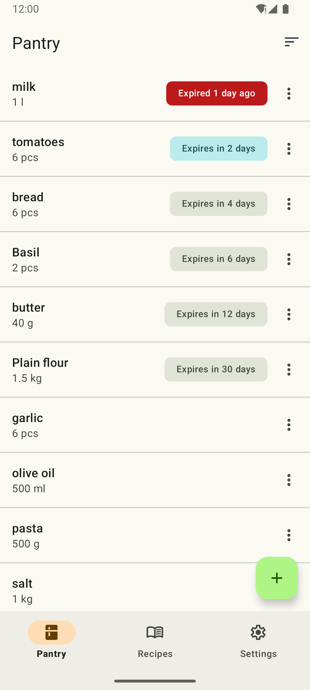{width=40%}

*Figure 3. The Pantry tab: ten items read live from Room, sorted by name, each amount with its unit
symbol and each expiry badge in its own colour, with the add button at the bottom.*

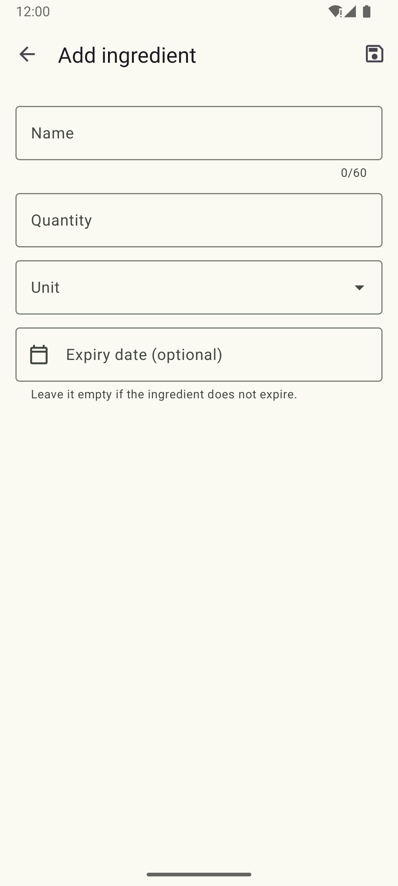{width=40%}

*Figure 4. The empty add form, opened from the add button: name, quantity, unit and an optional
expiry date, with Save in the toolbar.*

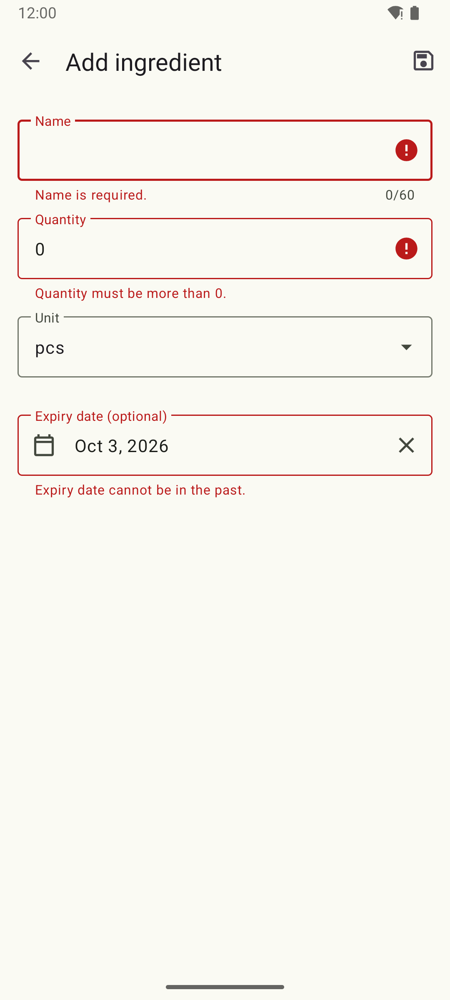{width=40%}

*Figure 5. Validation: Save with an empty name, a quantity of 0 and yesterday's date shows all three
errors at once under their fields, and nothing is written.*

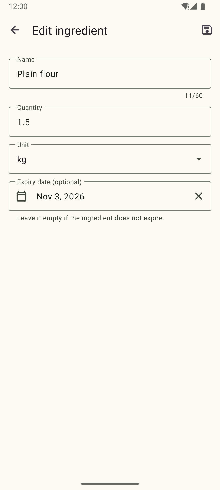{width=40%}

*Figure 6. The edit form, opened from a row's overflow menu with the item's id and prefilled from the
database; Save updates the same row.*

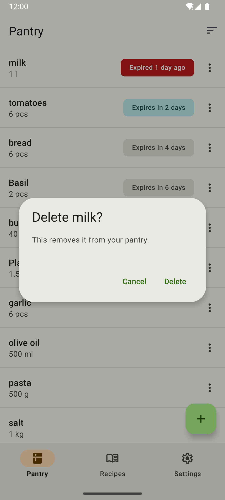{width=40%}

*Figure 7. The delete confirmation names the item; nothing is removed until Delete is tapped.*

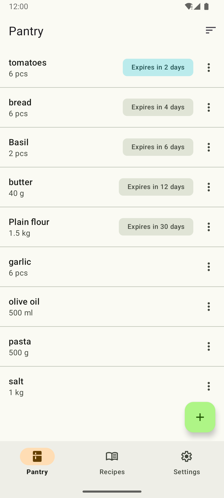{width=40%}

*Figure 8. After the delete, the row is gone without a refresh and "Deleted milk" offers Undo above
the add button.*

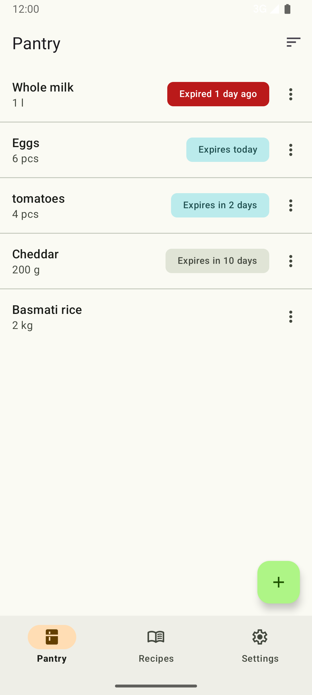{width=40%}

*Figure 9. Expiry badges, soonest first: expired on the error colours, expiring today and within the
three-day threshold on the warning colours, a later date neutral, and no badge for an undated item.*

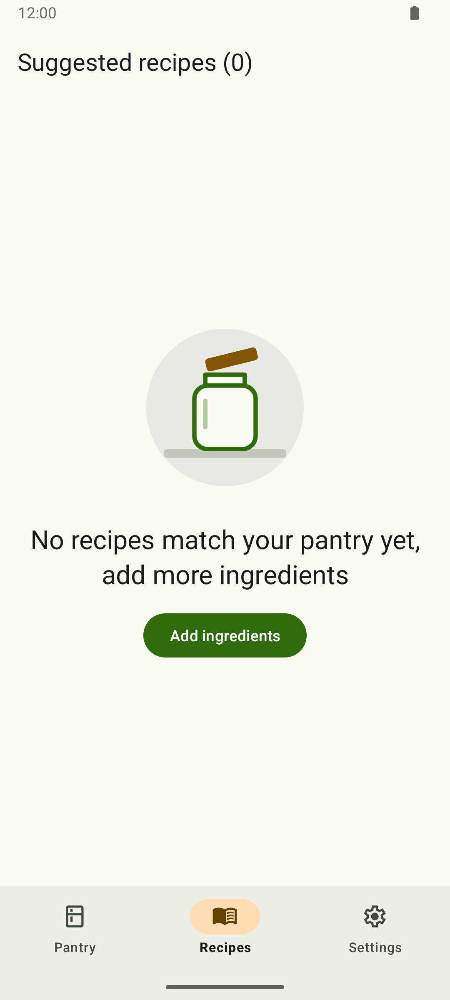{width=40%}

*Figure 10. The strict rule, before: the pantry holds four of Tomato pasta's five ingredients, so the
Recipes tab suggests nothing.*

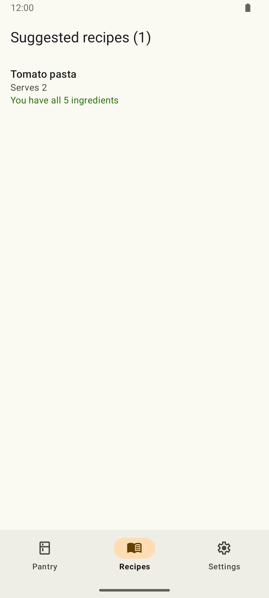{width=40%}

*Figure 11. The strict rule, after: with the fifth ingredient, garlic, added, Tomato pasta appears as
the one suggestion, with no refresh needed.*

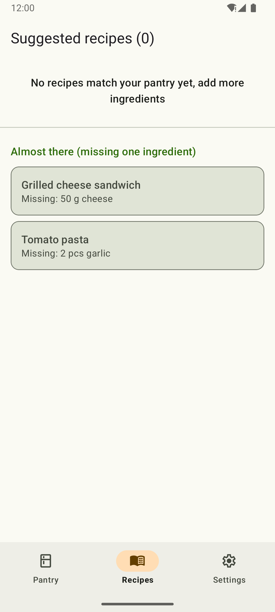{width=40%}

*Figure 12. The zero-match state: "No recipes match your pantry yet, add more ingredients", above the
separate almost-there section.*

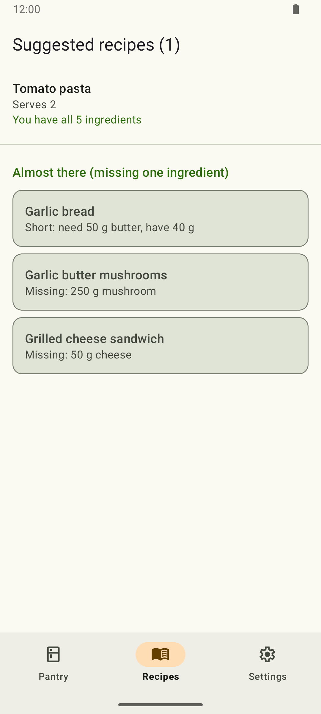{width=40%}

*Figure 13. The optional "Almost there" section, apart from the one suggestion: each card names the
single ingredient that is missing or short, and none is counted as a match.*

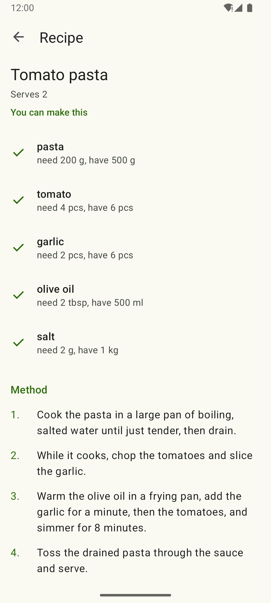{width=40%}

*Figure 14. Tomato pasta in full: each ingredient with a tick or a cross and the amount needed and
held, then the numbered method; every mark comes from the matcher.*

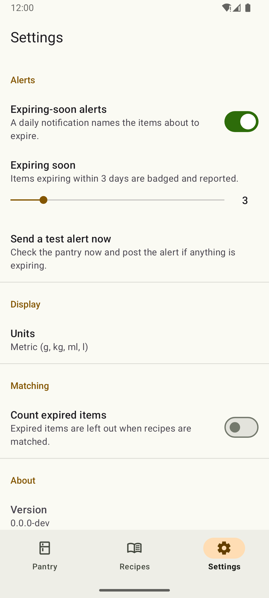{width=40%}

*Figure 15. The Settings tab: the expiry alert and its threshold, metric or imperial units, whether
expired items count, and the app version.*

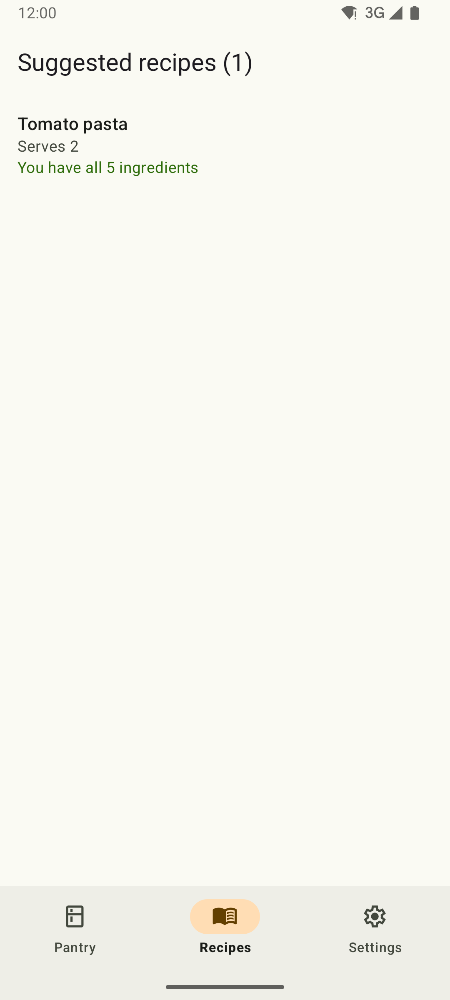{width=40%}

*Figure 16. A setting changing a match: with "Count expired items" on, the garlic that expired
yesterday counts again and Tomato pasta becomes a suggestion.*

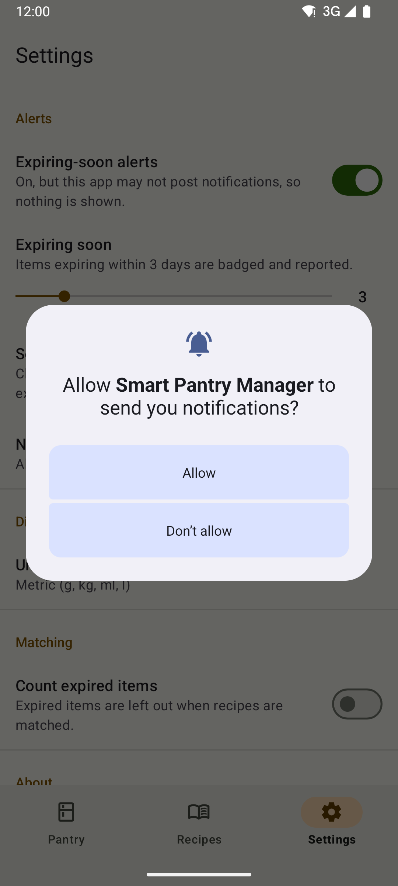{width=40%}

*Figure 17. On Android 13 and later, turning the alert on asks for the notification permission, while
the switch's summary already says the app may not post yet.*

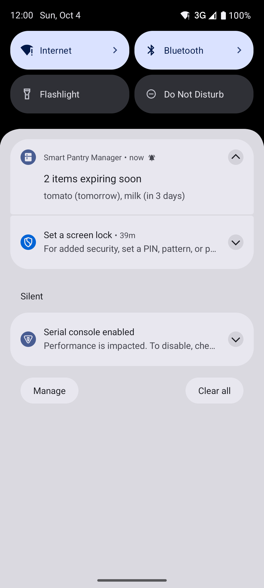{width=40%}

*Figure 18. The expiry notification: "2 items expiring soon, tomato (tomorrow), milk (in 3 days)";
tapping it opens the Pantry tab.*

# Key code snippets

Each snippet is copied unchanged from the tag or commit named above it.

## The strict matcher

`app/src/main/java/com/btk/spm/domain/matching/StrictMatcher.java`, lines 89 to 123, copied from tag
`v0.5.0` (unchanged since).

```java
    private MatchResult decide(Map<String, Map<UnitKind, CanonicalQuantity>> stock, RecipeSpec recipe) {
        Map<String, Map<UnitKind, CanonicalQuantity>> needs = needs(recipe);
        List<Shortfall> shortfalls = new ArrayList<>();
        List<IngredientCheck> checks = new ArrayList<>();
        for (RequiredIngredient required : recipe.ingredients()) {
            String name = normaliser.normalise(required.name());
            UnitKind kind = required.quantity().unit().kind();
            Map<UnitKind, CanonicalQuantity> held = stock.get(name);
            CanonicalQuantity have = held == null ? null : held.get(kind);
            boolean covered = have != null && have.isAtLeast(needs.get(name).get(kind));
            // Every line gets a check, so the detail screen can show "have" rows without comparing again
            checks.add(new IngredientCheck(required, have, covered));
            if (!covered) {
                shortfalls.add(new Shortfall(required, have));
            }
        }
        int needCount = recipe.ingredients().size();
        MatchStatus status = MatchStatus.forShortfalls(shortfalls.size());
        return new MatchResult(recipe.id(), status, shortfalls, needCount - shortfalls.size(), needCount, checks);
    }

    /** What the pantry holds: canonical totals by normalised name and kind, expired rows left out. */
    private Map<String, Map<UnitKind, CanonicalQuantity>> stock(List<PantryEntry> pantry,
                                                                MatchOptions options) {
        Objects.requireNonNull(options, "options");
        Map<String, List<Quantity>> rows = new HashMap<>();
        for (PantryEntry entry : Objects.requireNonNull(pantry, "pantry")) {
            // Decision 6: an expired row is absent unless the caller counts expired items
            if (options.includeExpired() || !ExpiryRules.isExpired(entry.expiry(), options.today())) {
                String name = normaliser.normalise(entry.name());
                rows.computeIfAbsent(name, k -> new ArrayList<>()).add(entry.quantity());
            }
        }
        return totals(rows);
    }
```

**Why it is written this way.** The whole strict rule lives in `decide`, and nothing else in the app
compares a pantry with a recipe: every screen reads the `MatchResult` it returns (Issue 20). A line is
covered only if the pantry holds the same normalised name in the same unit kind and at least the
amount needed, so there is no partial credit to leak into the suggestions. `MatchStatus.forShortfalls`
turns the count of shortfalls into `CAN_MAKE`, `ALMOST_THERE` or `CANNOT_MAKE`, which is why "almost
there" is a separate status rather than a softer threshold. `stock` builds the pantry map once, and
`matchAll` reuses it for all twenty recipes instead of normalising and converting the pantry twenty
times. The expiry check takes `options.today()` instead of reading the clock, which keeps the function
pure: the same inputs always give the same answer, so a JVM test can pin every scenario to a fixed
date.

## The pantry query that updates itself

`app/src/main/java/com/btk/spm/data/db/PantryItemDao.java`, lines 35 to 59, copied from tag `v0.5.0`
(these lines are unchanged since; a later method was added below them).

```java
@Dao
public interface PantryItemDao {

    /**
     * <b>C</b>: inserts a new item. An item whose id is {@code 0} gets a generated one; an item that
     * carries the id of a deleted row (undo, Issue 16) gets that row back.
     *
     * @param item the item to add, already validated (Issue 14)
     * @return the new row's id, above 0
     * @throws android.database.sqlite.SQLiteConstraintException if a row with the item's id exists
     */
    @Insert
    long insert(@NonNull PantryItem item);

    /**
     * <b>R</b>: the whole pantry, ordered by name without regard to case ({@code banana},
     * {@code Eggs}, {@code flour}), then by when each item was added, then by id, so two rows never
     * swap places between emissions. The {@code LiveData} emits again after every change to the
     * table.
     *
     * @return every item, never {@code null} once delivered
     */
    @Query("SELECT * FROM pantry_items ORDER BY name COLLATE NOCASE ASC, created_at ASC, id ASC")
    @NonNull
    LiveData<List<PantryItem>> observeAll();
```

**Why it is written this way.** `observeAll` returns `LiveData` rather than a plain list, so Room
re-runs the query whenever `pantry_items` changes and delivers the new list to whoever is observing
(Issue 9; Android Developers, n.d.c). The Pantry tab never reloads after a save or a delete, and the
Recipes tab matches again on its own when the pantry changes, because its ViewModel observes the same
query and survives rotation (Android Developers, n.d.d). The ordering has a tie-breaker on creation
time and then id, so two items with the same name never swap places between emissions and the list
does not flicker. Writing the SQL in the annotation also means a misspelt column is a compile error
rather than a crash on a user's phone.

## Opening a screen with an explicit Intent

`app/src/main/java/com/btk/spm/util/IntentKeys.java`, lines 20 to 24, and
`app/src/main/java/com/btk/spm/ui/recipes/RecipeDetailActivity.java`, lines 50 to 61, both copied from
tag `v0.5.0`:

```java
    /** The {@code long} id of the pantry item to edit (Issue 15); absent when adding a new item. */
    public static final String EXTRA_PANTRY_ITEM_ID = PREFIX + "PANTRY_ITEM_ID";

    /** The {@code long} id of the recipe a detail screen shows (Issue 25). */
    public static final String EXTRA_RECIPE_ID = PREFIX + "RECIPE_ID";
```

```java
    /**
     * Returns the Intent that opens this screen on one recipe: its id travels in
     * {@link IntentKeys#EXTRA_RECIPE_ID}, the one place the extra's name is written.
     *
     * @param context  the screen starting the Intent
     * @param recipeId the {@code recipes.id} of the recipe to show
     * @return an explicit Intent for {@code RecipeDetailActivity} carrying the id
     */
    @NonNull
    public static Intent intentFor(@NonNull Context context, long recipeId) {
        return new Intent(context, RecipeDetailActivity.class).putExtra(IntentKeys.EXTRA_RECIPE_ID, recipeId);
    }
```

The receiving side, `RecipeDetailActivity.java` lines 65 to 69, copied from tag `v0.6.0`
(the comment on line 68 changed after `v0.5.0`):

```java
    @Override
    protected void onCreate(@Nullable Bundle savedInstanceState) {
        super.onCreate(savedInstanceState);
        // Read once, with a default that means "absent"
        long recipeId = getIntent().getLongExtra(IntentKeys.EXTRA_RECIPE_ID, NO_ID);
```

**Why it is written this way.** The detail screen needs one thing, the recipe's id, so the Intent
carries only that, and only `intentFor` builds it (Issue 25). The caller cannot forget the extra or
spell its name differently from the reader, because both sides use the constant in `IntentKeys`; a
key typed as a literal string would compile and then fail silently at run time, so a convention test
fails the build on one. The name carries the package prefix so it cannot clash with another app's
extra. Passing the id rather than the recipe object keeps the Intent small and means the detail screen
always reads the current data from Room. A missing extra comes back as `NO_ID`, and the screen shows
"Recipe not found" instead of crashing. The edit path of `AddEditIngredientActivity` follows the same
pattern with `EXTRA_PANTRY_ITEM_ID` (Issue 15).

## The adapter's difference callback

`app/src/main/java/com/btk/spm/ui/pantry/PantryAdapter.java`, lines 173 to 189, copied from tag
`v0.5.0` (unchanged since; the file's line numbers moved later).

```java
    /**
     * How {@link ListAdapter} compares two lists of the pantry. Two items are the same row when their
     * ids match; the row needs rebinding when anything in it changed, which {@link PantryItem#equals}
     * decides over every column.
     */
    static final class ItemDiff extends DiffUtil.ItemCallback<PantryItem> {

        @Override
        public boolean areItemsTheSame(@NonNull PantryItem oldItem, @NonNull PantryItem newItem) {
            return oldItem.getId() == newItem.getId();
        }

        @Override
        public boolean areContentsTheSame(@NonNull PantryItem oldItem, @NonNull PantryItem newItem) {
            return oldItem.equals(newItem);
        }
    }
```

**Why it is written this way.** `PantryAdapter` extends `ListAdapter` instead of keeping its own list
and calling `notifyDataSetChanged()` (Issue 13). Each time Room emits, the Fragment hands the whole new
list to `submitList`, and this callback lets `DiffUtil` work out, on a background thread, which rows
were added, removed, moved or changed (Android Developers, n.d.e; n.d.f). Only those rows are rebound
and animated, so deleting one item slides that row out and leaves the rest where they are, and Undo
puts it back in place. Two items are the same row when their ids match; the contents are the same when
every column is equal, which `PantryItem.equals` decides. Rebinding everything would lose the animations and the scroll position.

# Challenges and solutions

## Plurals that the normaliser got wrong (Issue 18)

The first run of the normaliser's test table had six failing rows out of fifty-nine. The first was
"olives", which came out as "olif"; "cloves" and "chives" failed the same way. A pantry holding
garlic cloves could never have matched a recipe that needs a clove. The cause was the plural rule
itself. I had written "-ves becomes -f" because it is the textbook rule (loaves, halves), but most
"-ves" words in a kitchen are an "-ve" word plus "s". Only "-lves", "-eaves" and "-oaves" come from an
"-f" word. The same mistake turned "pies" into "py" and "watercress" into "watercres".

The fix narrowed the "-ves" rule to those three endings, left words ending in "ss" alone, and read
"-ies" on four-letter words as "-ie" plus "s". The failing rows were committed before the fix, so the
history shows them go red and then green. A later check found that "cookies" and "chillies" cannot be
told apart from "berries" by spelling at all, so those few words went into a short named list, each
with its own test row. What changed afterwards was how I write test tables: rows now come from an
ordinary shopping list rather than from the examples that suggested the rule, and every row also
normalises its own result a second time to prove the rule is stable.

## A deleted recipe that was "still there" (Issue 26)

Issue 26 had to prove on a device that the Recipes tab follows the pantry live: add the fifth
ingredient and Tomato pasta appears, delete it and the recipe goes. The first run failed at the last
step. On screen there was no row, only the empty state, yet Espresso reported that a view with the
text "Tomato pasta" was still in the hierarchy.

The cause was in the screen, not the data. When the list empties, the Fragment hides the
`RecyclerView` and shows the empty state. A hidden view gets no layout pass, so the removed row's view
stayed attached to the hidden list. The test had asked "is there a view with this text?" when the
user's question is "can I see it?". The fix was to match only displayed views and to wait for the
adapter's own change notice, because `ListAdapter` works out the differences on a background thread
that Espresso does not watch. Writing the test also exposed a gap: the empty state did not carry the
almost-there recipes, so a recipe four ingredients out of five had nowhere to be shown. The state class
now carries them. Since then, every device test asserts what is displayed, and Issue 32 made the waiting a shared
rule.

## An alert that was "on" but could not post (Issue 29)

The first build of the daily expiry check failed Lint with `MissingPermission` on the call that posts
the notification. On the Android 15 emulator a fresh install also showed the alert switch on, as its
default says, while the app was not allowed to post anything. On API 26 the same build worked at
once.

The cause is that Android 13 made notifications a runtime permission (Android Developers, n.d.g). An
app that targets API 33 or later, as this one does, starts with it denied; below 33 it is granted at
install, which is why the older emulator hid the problem. A user can also block notifications in
system settings at any time. The fix put the question in one place, `NotificationAccess.canPost`,
which both the worker and the Settings tab ask. The Settings tab requests the permission when the user
turns the alert on, explains why if they have refused before, and on a refusal turns the switch back
off, cancels the daily job and shows a shortcut to the system settings. The worker simply does nothing
when it may not post. Afterwards the worker gained tests that run it on demand, and I took away that a setting is a
promise the code must keep on every API level.

# Conclusion and reflection

Smart Pantry Manager does what the brief asks: it keeps a pantry on the device with a full create,
read, update and delete cycle, validates every field, badges and reports expiring items, and suggests
a recipe only when the pantry holds every ingredient in at least the required amount. The screens
update themselves when the data changes, and the rule that decides a match is written once and tested
on its own.

Building it taught me several things. The Activity and Fragment lifecycles stopped being a diagram
once I logged them and rotated the phone: a Fragment's view is destroyed and recreated while its
ViewModel survives, so observers must be tied to the view's lifecycle or they deliver twice. Room with
`LiveData` removed a whole class of bugs, because no screen has to remember to reload. Keeping the
matching engine free of Android made it the best-tested part of the app, with scenario tables that run
in seconds. Finally, committing one real step at a time, with failing tests committed before their
fixes, gave me a history I could use to explain every decision, which is what this report and the
video rely on.

Given more time, I would improve five things. First, units: a recipe that asks for two cups of flour
does not match 500 g of flour in the pantry, because converting a volume to a mass needs a density per
ingredient (decision 5). A small density table for the few ingredients people measure both ways, such
as flour, sugar, rice and butter, would close most of that gap, with a test row for each. Second,
recipes are read-only seed data (decision 7); letting the user add and edit their own recipes would
make the app useful beyond the twenty it ships with. Third, a photo per pantry item would make the
list quicker to scan. Fourth, the matcher already returns a `Shortfall` for each missing or short
ingredient, so a shopping list built from the almost-there recipes is mostly a new screen over data
that exists. Fifth, a home-screen widget for expiring items would put the reminder where the user
already looks.

# Reference list

References follow the Harvard style.

Android Developers (n.d.a) *Save data in a local database using Room*. Available at:
<https://developer.android.com/training/data-storage/room> (Accessed: 4 October 2026).

Android Developers (n.d.b) *Intents and intent filters*. Available at:
<https://developer.android.com/guide/components/intents-filters> (Accessed: 4 October 2026).

Android Developers (n.d.c) *LiveData overview*. Available at:
<https://developer.android.com/topic/libraries/architecture/livedata> (Accessed: 4 October 2026).

Android Developers (n.d.d) *ViewModel overview*. Available at:
<https://developer.android.com/topic/libraries/architecture/viewmodel> (Accessed: 4 October 2026).

Android Developers (n.d.e) *Create dynamic lists with RecyclerView*. Available at:
<https://developer.android.com/develop/ui/views/layout/recyclerview> (Accessed: 4 October 2026).

Android Developers (n.d.f) *ListAdapter*. Available at:
<https://developer.android.com/reference/androidx/recyclerview/widget/ListAdapter> (Accessed: 4
October 2026).

Android Developers (n.d.g) *Notification runtime permission*. Available at:
<https://developer.android.com/develop/ui/views/notifications/notification-permission> (Accessed: 4
October 2026).

Android Developers (n.d.h) *Schedule tasks with WorkManager*. Available at:
<https://developer.android.com/develop/background-work/background-tasks/persistent> (Accessed: 4
October 2026).

Google (n.d.) *Material Design 3*. Available at: <https://m3.material.io/> (Accessed: 4 October 2026).

[Institution] (2026) *Mobile App Development 700: module notes*. Unpublished course material.

Katalayi, B. (2026) *Smart Pantry Manager* [Source code]. GitHub. Available at:
<https://github.com/Billykat7/spm> (Accessed: 4 October 2026).
