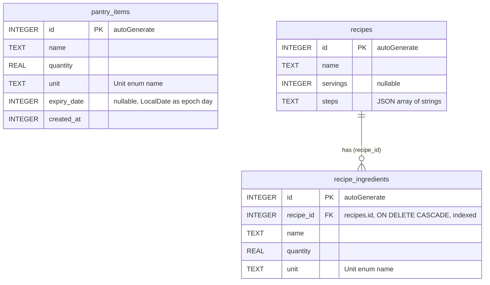

# ER diagram

**Figure 2.** Entity-relationship diagram of the Room database, schema version 1, drawn from
`app/schemas/com.btk.spm.data.db.AppDatabase/1.json`. Types are the SQLite column affinities Room
exported; every column is `NOT NULL` unless marked nullable.

## How to read it

The database has three tables and one relation: a recipe has zero or more ingredient rows, each
pointing back at it through `recipe_ingredients.recipe_id`, a foreign key to `recipes.id` with
`ON DELETE CASCADE` and its own index (`index_recipe_ingredients_recipe_id`). `pantry_items` stands
alone, because a pantry item is matched to a recipe ingredient by its normalised name and canonical
quantity, not by a key. SQLite has no enum or date type, so `Converters`, registered on
`AppDatabase` with `@TypeConverters(Converters.class)`, stores a `Unit` as its enum name in `TEXT`
(`unitToName` and `nameToUnit`), a `LocalDate` as its epoch day in `INTEGER` (`dateToEpochDay` and
`epochDayToDate`), so expiry dates sort and compare as numbers, and a recipe's steps as one JSON
array in `TEXT` (`stepsToJson` and `jsonToSteps`). A null `expiry_date` means the item never
expires. Ingredients are their own table rather than a JSON column because the matcher reads them
row by row, and Room loads a recipe with its ingredients through `RecipeWithIngredients`: the
`recipes` row is `@Embedded` and the list is filled by
`@Relation(parentColumn = "id", entityColumn = "recipe_id")`, which `RecipeDao` returns from every
read.
