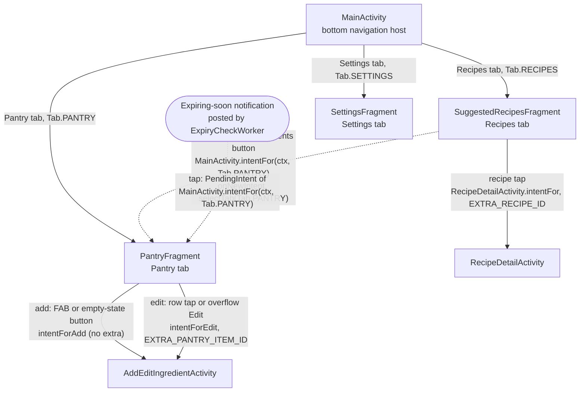

# Screen flow

**Figure 1.** Screen flow of Smart Pantry Manager: one host Activity with three tab Fragments, two
Activities opened by explicit Intents, and the expiring-soon notification. Drawn from the classes
under `app/src/main/java/com/btk/spm/`.

## How to read it

Each box is a real class and each arrow is a way the user gets from one screen to the next, labelled
with what triggers it and the code that does it. `MainActivity` is the only screen the launcher opens;
its bottom navigation swaps the three tab Fragments (`PantryFragment`, `SuggestedRecipesFragment`,
`SettingsFragment`) in one container, chosen through the `Tab` enum. The two screens that need a
record are separate Activities opened by explicit Intents built by their own factory methods:
`AddEditIngredientActivity.intentForAdd` carries no extra, which means add, and `intentForEdit`
carries the row's id in `IntentKeys.EXTRA_PANTRY_ITEM_ID`, which means edit;
`RecipeDetailActivity.intentFor` carries the recipe's id in `IntentKeys.EXTRA_RECIPE_ID`. The dashed
arrows both land on the Pantry tab through `MainActivity.intentFor(ctx, Tab.PANTRY)`, which carries
the tab in `IntentKeys.EXTRA_TAB` with `FLAG_ACTIVITY_CLEAR_TOP | FLAG_ACTIVITY_SINGLE_TOP`, so a
running host receives it in `onNewIntent` and calls `selectTab(Tab.PANTRY)` rather than opening a
second `MainActivity`. This is decision 3 (navigation shape) of the project's recorded decisions:
Fragments in one host Activity for the tabs, and Activities with explicit Intents and extras for the
screens that carry data.
